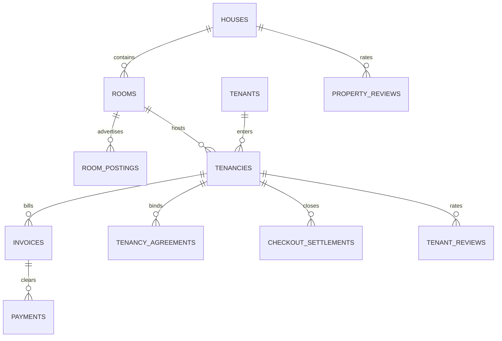

# GharKoHisaab (घरको हिसाब) 🏡📄
## Client Handover & Technical Documentation

Welcome to the official handover documentation for **GharKoHisaab** (घरको हिसाब). This document outlines the system architecture, core business logic, database schema, verification procedures, and client operating guidelines.

---

## 📱 1. Core Technical Stack & Architecture

GharKoHisaab is built as an offline-first mobile checkbook and rental ledger application:

| Layer | Component | Notes |
| :--- | :--- | :--- |
| **Frontend Framework** | React Native (Expo SDK 57) | Configured with TypeScript, Hermes engine, and styled with a custom high-contrast Indigo-Slate system. |
| **Local Database** | SQLite (with Drizzle ORM) | Custom SQLite connection abstraction with an offline-first storage fallback (compatible with `localStorage` for Web execution). |
| **Backend & Sync** | Supabase (PostgreSQL + RLS) | Designed to synchronize pending local changes to remote PostgreSQL once network connectivity is detected. |
| **Platform Adaptations** | Web-Aware Responsive Layouts | Grid layouts toggle from single-column on mobile screens to responsive 2-column configurations on wide monitors. |

---

## 📅 2. Nepali Calendar (Bikram Sambat) Billing Cycles

Unlike standard western calendar applications, GharKoHisaab implements a custom billing scheduler matching the Nepali rental market:
*   **B.S. Date Math**: Invoices are generated dynamically based on the monthly anniversary of a tenant's checkout start date in the Bikram Sambat calendar.
*   **Variable Months**: Handles Nepali month variations (where months range between 29 to 32 days depending on the year) by clamping day boundaries and matching cycle periods.
*   **A.D. UTC Storage**: Local inputs are converted and stored as standard UTC timestamps for cross-platform compatibility and system consistency.

---

## 🔒 3. Key Workflows & Features

### A. Tenancy Agreement (Dual Digital Signatures)
*   **Drafting Terms**: Housekeepers draft agreements containing rent, utility rates, and advance deposit amounts.
*   **Interactive Signature Pad**: Both parties sign directly on the screen. The signatures are saved as digital SVG path vectors linked directly to the tenancy contract.

### B. Double-Confirmation Cash Payments (Anti-Fraud)
*   **OTP Verification**: When a cash payment is registered for a tenant who does not have the app, an SMS OTP code is simulated and sent to the tenant's number. Shared verbally, this OTP must be entered by the housekeeper to validate the receipt.
*   **Signature Lock**: Validated receipts become immutable accounting records. Any adjustments must be processed as separate reversal entries, preventing unilateral record tampering.

### C. 3-Step Checkout Settlement Wizard
*   **Step 1 (Date)**: Determines the checkout date in B.S. and calculates the pro-rated rent due for the final billing cycle.
*   **Step 2 (Dues)**: Logs final sub-meter electricity readings, waste fees, flat utilities, and property damage charges.
*   **Step 3 (Reconciliation)**: Automatically calculates the final balance:
    $$\text{Balance} = \text{Pro-rated Rent} + \text{Utility Dues} + \text{Arrears} + \text{Damage} - \text{Security Deposit Held}$$
    Highlights whether the tenant owes money (debit) or the housekeeper owes a refund (credit).

### D. Tenant & Property Reviews System
*   **Reputation Rating**: Landlords submit a 1–5 star rating and feedback comments during checkout, recalculating the tenant's average score dynamically.
*   **Property Feedback**: Active tenants can rate property conditions, water availability, and housekeeper responsiveness directly on the profile card.

---

## 🗃️ 4. Database Schema Reference

The tables configured in [schema.ts](file:///Users/suppu/GharKoHisaab/src/database/schema.ts) are outlined below:



1.  **`houses`**: Stores property housekeeper name, address, and auto-generated defaults.
2.  **`rooms`**: Tracks room numbers, rents, and active statuses (`vacant` / `occupied`).
3.  **`room_postings`**: Public marketplace listings marked as *"Post Publicly"* (सार्वजनिक विज्ञापन).
4.  **`tenants`**: Tenant details, government ID verification (KYC), and average rating index.
5.  **`tenancies`**: Links rooms and tenants, tracking deposits and active tenancy status.
6.  **`tenancy_agreements`**: Terms, SVG signatures, device IDs, and signed timestamps.
7.  **`invoices`**: Monthly bill details, pro-rated rent, utility calculations, and arrears carried forward.
8.  **`payments`**: Logs eSewa, Khalti, bank, or cash payments, OTP codes, and confirmations.
9.  **`checkout_settlements`**: Captures damage audits, pro-rated rents, deposit returns, and settlement status.
10. **`tenant_reviews`**: Houses landlord feedback and ratings submitted during checkout.
11. **`property_reviews`**: Houses tenant feedback and ratings on houses.

---

## 🛠️ 5. Developer & Handover Operations

### A. Environment Configuration & Setup
To install project dependencies:
```bash
npm install
```

To run the local development server (Metro bundler):
```bash
npm start
```
*Press `w` in the terminal to load the application in a web browser.*

### B. Verification Procedures
Run type safety compilation checks:
```bash
npx tsc --noEmit
```

Run Jest test suite (validates Nepali billing dates, settlements, reviews):
```bash
npm test
```

---

## 📝 6. Client Operation Guide

1.  **Set Up Property**: On first load, enter your name. The app automatically provisions a default house (e.g. `Suresh's House 1`).
2.  **Add Rooms**: Define room numbers and base rents (e.g., Room 401, Rs. 16,000).
3.  **Onboard Tenant**: Enter tenant name, phone, deposit, and utilities rate.
4.  **Sign Agreement**: Landlord and Tenant sign. The tenancy status changes to `OCCUPIED`.
5.  **Generate Invoices**: Input utility sub-meter readings on billing anniversaries.
6.  **Record Settlements**: Process checkouts through the 3-step wizard. Deduct damage fees, reconcile deposits, and log the final transaction.
